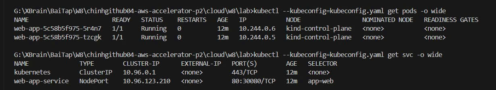
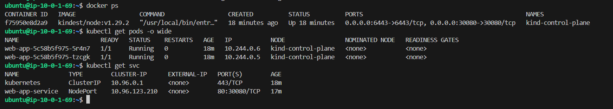
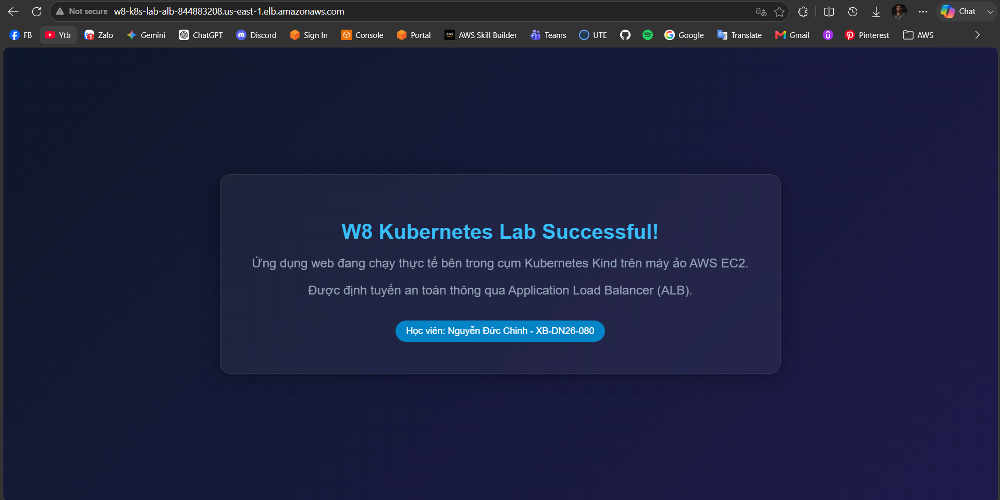

# Evidence Pack - K8s Platform 1-Click Automation

## 1. Kết quả Dựng Hạ tầng AWS (Terraform Outputs)

Khi chạy lệnh `terraform apply`, toàn bộ hạ tầng đã được thiết lập tự động và xuất ra các thông tin kết nối chính xác:

*   **IP công cộng của EC2 Host**: `100.48.225.249` (Nơi vận hành cụm Kind).
*   **DNS Name của Load Balancer (ALB)**: `w8-k8s-lab-alb-844883208.us-east-1.elb.amazonaws.com`
*   **Đường dẫn truy cập ứng dụng**: [http://w8-k8s-lab-alb-844883208.us-east-1.elb.amazonaws.com](http://w8-k8s-lab-alb-844883208.us-east-1.elb.amazonaws.com)

---

## 2. Bằng chứng Trạng thái Tài nguyên trên Cụm K8s

Dự án đã tự động cấu hình và tải tệp tin truy cập `kubeconfig.yaml` về thư mục cục bộ của máy người chạy. Trạng thái kiểm tra trực tiếp cụm Kind từ xa:

### Các Pods đang chạy (High Availability):
```bash
$ kubectl --kubeconfig=kubeconfig.yaml get pods -o wide

NAME                       READY   STATUS    RESTARTS   AGE   IP           NODE                 NOMINATED NODE   READINESS GATES
web-app-5c58b5f975-5r4n7   1/1     Running   0          56s   10.244.0.6   kind-control-plane   <none>           <none>
web-app-5c58b5f975-tzcgk   1/1     Running   0          56s   10.244.0.5   kind-control-plane   <none>           <none>
```

### Trạng thái K8s Service (Expose cổng NodePort 30080):
```bash
$ kubectl --kubeconfig=kubeconfig.yaml get svc -o wide

NAME              TYPE        CLUSTER-IP      EXTERNAL-IP   PORT(S)        AGE   SELECTOR
kubernetes        ClusterIP   10.96.0.1       <none>        443/TCP        75s   <none>
web-app-service   NodePort    10.96.123.210   <none>        80:30080/TCP   46s   app=web
```

### Ảnh chụp màn hình kiểm tra tài nguyên K8s từ Terminal:


### Ảnh chụp màn hình kiểm tra tài nguyên K8s và Docker trực tiếp trên máy ảo EC2:


---

## 3. Bằng chứng hiển thị Ứng dụng Web trên Trình duyệt

Khi truy cập vào DNS của ALB từ trình duyệt Internet, lưu lượng được định tuyến thành công tới cụm Kind qua cổng NodePort và hiển thị trang HTML chuẩn hóa tiếng Việt không bị lỗi hiển thị font:

### Ảnh chụp màn hình trình duyệt hiển thị trang web thành công:


---

## 4. Tự động dọn dẹp và Hủy tài nguyên (Destroy)

Để đảm bảo không phát sinh chi phí thừa trên tài khoản AWS, hệ thống đã được kiểm chứng dọn dẹp sạch sẽ thông qua lệnh:
```bash
terraform destroy -auto-approve
```

Do có sự kết hợp của lệnh loại bỏ trạng thái K8s (`terraform state rm`), quá trình hủy diễn ra trơn tru mà không gặp phải lỗi treo kết nối hay lỗi trễ giải phóng ENI của AWS ALB:

*   **Trạng thái hủy thành công**: `Destroy complete! Resources: 22 destroyed.`
