# Evidence pack W9 - GitOps & Observability Automation

## Phần 1: Kiến trúc GitOps Cốt lõi (App-of-Apps & CI)

### 1.1. Kiến trúc App-of-Apps trên ArgoCD
Hệ thống được thiết kế theo mô hình App-of-Apps, trong đó một Application `root` duy nhất quản lý toàn bộ các thành phần hạ tầng và ứng dụng (Prometheus, API). Mọi sự thay đổi thư mục `apps/` trên Git đều được ArgoCD tự động đồng bộ.
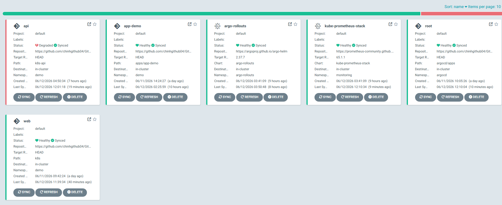

### 1.2. Cơ chế Self-Heal (Tự chữa lành)
Hệ thống tuân thủ nguyên tắc "Git is the Single Source of Truth". Khi có tác động bằng tay (ví dụ: `kubectl scale` sai số lượng Pods), ArgoCD lập tức phát hiện lệch (OutOfSync) và tự động kéo (Self-Heal) trạng thái của cụm về đúng như khai báo trên Git.
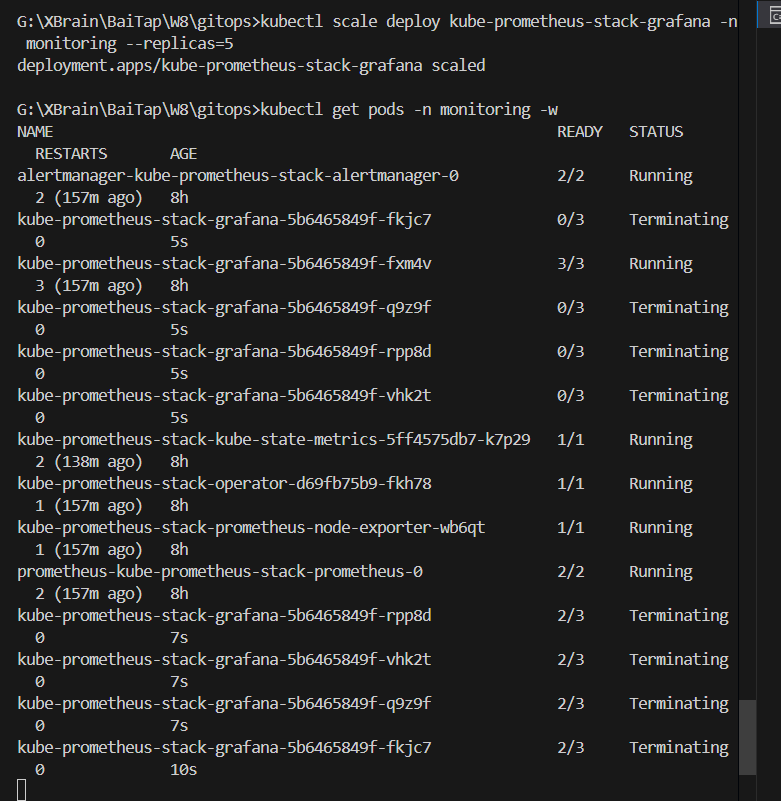

### 1.3. Áp dụng Sync Waves
Các tài nguyên được khởi tạo theo đúng trình tự bắt buộc nhờ `sync-wave` (Namespace trước -> ConfigMap/Secret -> Deployment -> Service), ngăn chặn triệt để lỗi Pod khởi động trước khi Config tồn tại.
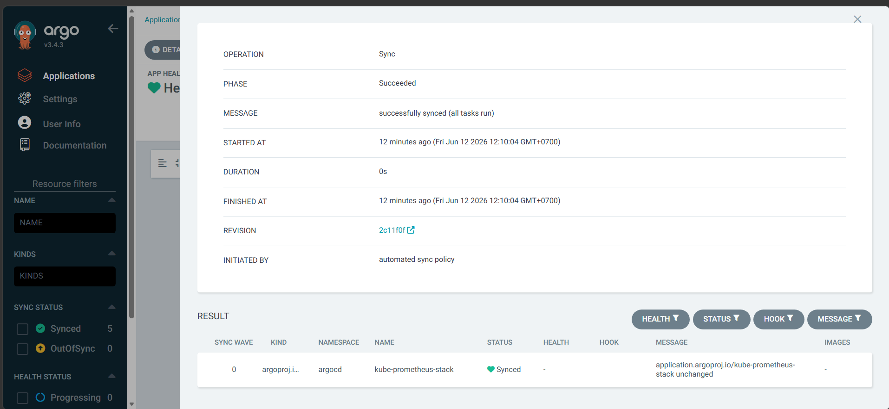

### 1.4. CI Validation & Branch Protection
Mã nguồn được kiểm duyệt tự động bằng GitHub Actions (chạy `kubeconform` để kiểm tra lỗi cú pháp YAML). Quyền push thẳng vào nhánh `main` bị khóa chặt, mọi thay đổi phải qua Pull Request và CI xanh mới được merge.
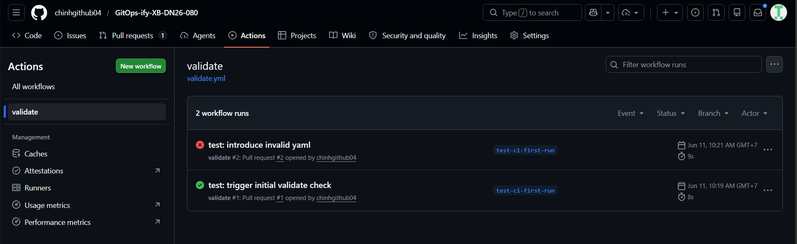

### 1.5. Triển khai Ứng dụng Demo (Frontend & Backend)
Triển khai thành công ứng dụng demo đa tầng trong namespace `demo` gồm:
*   **Backend**: Sử dụng `hashicorp/http-echo` trả về cấu trúc JSON chứa tên học viên: `{"message":"XB-DN26-080 Nguyễn Đức Chinh"}`.
*   **Frontend**: Chạy Nginx đóng vai trò Web Server phục vụ giao diện HTML/JS tĩnh, đồng thời reverse proxy cổng `/api` về `backend-service`. Khi người dùng truy cập, Frontend sẽ gọi API để hiển thị lời chào động từ Backend.
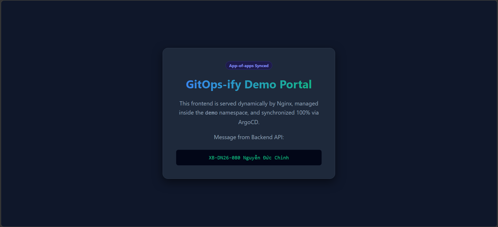

---

## Phần 2: Observability (Giám sát & Đo lường)

### 2.1. Triển khai Kube-Prometheus-Stack
Ngăn xếp giám sát toàn diện đã được triển khai tự động qua GitOps, bao gồm Prometheus (thu thập metrics), Alertmanager (gửi cảnh báo) và Grafana (trực quan hóa).
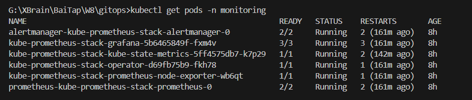

### 2.2. Đo lường Custom Metrics
Dịch vụ Python Flask `w9-api` phơi bày các chỉ số tùy chỉnh (số lượng request, mã lỗi 500) và được Prometheus tự động Scrape thông qua ServiceMonitor.
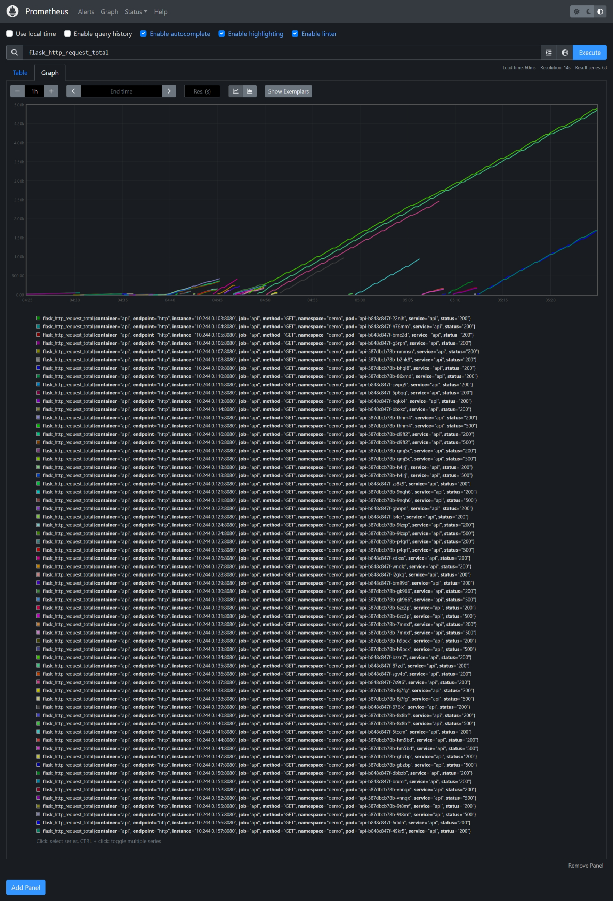

### 2.3. Thiết lập Chỉ số Đo lường (SLI/SLO)
Để đảm bảo chất lượng dịch vụ, chúng ta thiết lập các chỉ số SLO và SLI cụ thể cho dịch vụ API:
*   **SLI (Chỉ số đo lường thực tế)**: Tỷ lệ các HTTP requests trả về mã thành công (non-5xx) trên tổng số requests nhận được trong vòng 30 giây qua.
    *   *Công thức*: `sum(rate(flask_http_request_total{status!~"5.."}[30s])) / sum(rate(flask_http_request_total{}[30s]))`
*   **SLO (Mục tiêu cam kết nội bộ)**: Mức độ tin cậy mục tiêu được đặt ra là **95% Success Rate** (tương đương tỷ lệ lỗi 5xx không vượt quá **5%**).
*   **Cấu hình Cảnh báo (PrometheusRule)**: Định nghĩa trong `alerts.yaml`. Nếu tỷ lệ lỗi 5xx vượt quá **5%** (tức là vi phạm SLO), hệ thống sẽ ngay lập tức kích hoạt cảnh báo `ApiHighErrorRate`.
    *   *Query*: `sum(rate(flask_http_request_total{status=~"5..", job="api", namespace="demo"}[30s])) / sum(rate(flask_http_request_total{job="api", namespace="demo"}[30s])) > 0.05`

---

## Phần 3: Automated Canary Deployments

### 3.1. Quản lý luồng Rollout bằng Argo Rollouts
Ứng dụng API không dùng Deployment thông thường mà dùng `Rollout` với chiến lược Canary, cho phép phân bổ traffic tăng dần (25% -> 50% -> 100%) thay vì cập nhật ồ ạt.
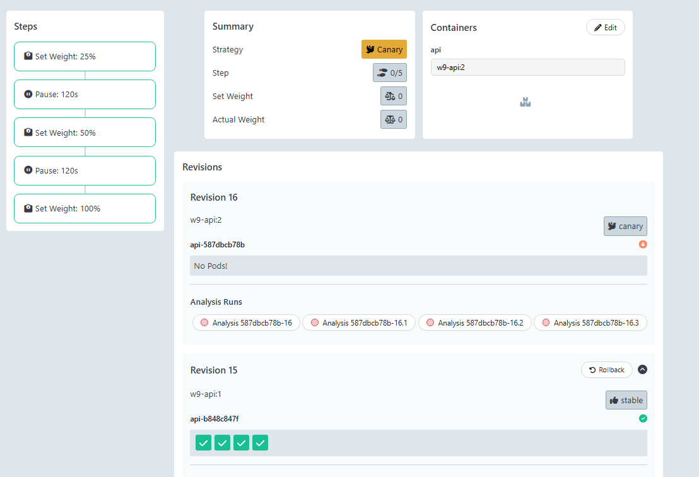

### 3.2. Cấu hình AnalysisTemplate (Tự động hóa đánh giá)
Quá trình nâng cấp phiên bản không cần người duyệt. Rollout tự động móc nối với Prometheus, truy vấn `success-rate` của riêng các Pod phiên bản mới (cô lập bằng `canary-hash`). Nếu tỷ lệ thành công >= 95%, hệ thống mới cho phép đi tiếp.
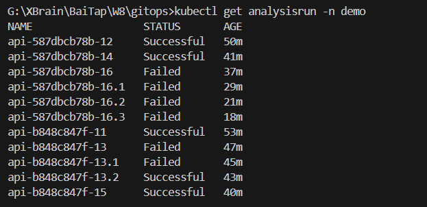

---

## Phần 4: Thử thách "Ship Smartly" (Kịch bản Chống Thảm họa)

Để chứng minh độ an toàn tuyệt đối của kiến trúc, một phiên bản lỗi (`v2` với `ERROR_RATE=0.5`) đã được cố tình đẩy lên Git.

### 4.1. Tự động Hủy cập nhật (Auto-Abort & Rollback)
Nhờ giới hạn lỗi khắt khe trong AnalysisTemplate, ngay khi Prometheus bắt được tín hiệu mã lỗi 500 từ Canary pods, Argo Rollouts đã lập tức đánh trượt (Failed), tự động đóng băng đợt cập nhật (Abort) và điều hướng 100% traffic trở lại bản `v1` ổn định, bảo vệ người dùng cuối.
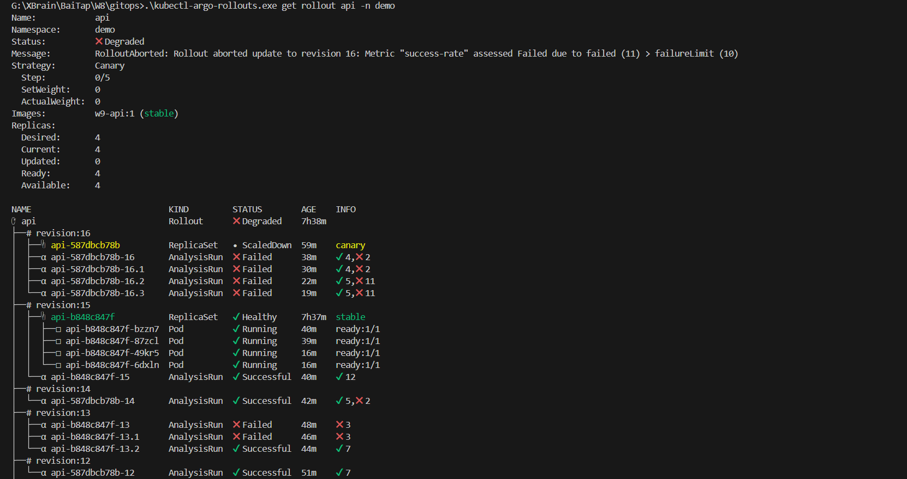

### 4.2. Cảnh báo Tự động (Alertmanager tới Gmail)
Alertmanager được tích hợp hoàn chỉnh và bảo mật qua Kubernetes Secret thay vì lưu mật khẩu trên Git. Khi tỷ lệ lỗi vượt quá 5%, hệ thống gửi ngay lập tức một thư "Báo động Đỏ" về email cá nhân của kỹ sư vận hành để phản ứng sự cố kịp thời.
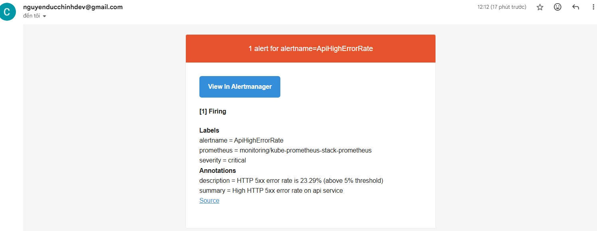
